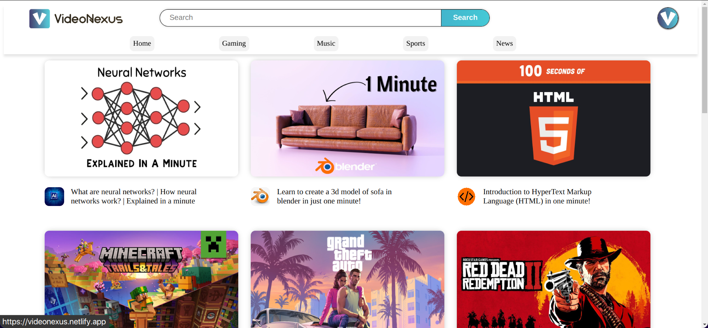

# Video Nexus

**Video Nexus** is a dynamic video-sharing entertainment platform built using HTML, CSS, and JavaScript. It allows users to explore a wide range of video categories, offering a seamless and enjoyable video playback experience. With its user-friendly design and responsiveness, it delivers a smooth experience across all devices.

## Table of Contents
- [Features](#features)
- [Screenshots](#screenshots)
- [Usage](#usage)
- [Technologies Used](#technologies-used)
- [Contributing](#contributing)
- [License](#license)

## Features
- Browse videos across various categories.
- Simple and intuitive video playback controls.
- Clean and modern user interface.

## Screenshots

## Usage
1. Launch the platform by opening this [link](https://videonexus.netlify.app/).
2. Browse through the video categories.
3. Click on any video to start playback.

## Technologies Used
- HTML
- CSS
- JavaScript

## Contributing
Contributions, issues, and feature requests are welcome!  
Feel free to check out the [issues page](https://github.com/miansaadtahir/videonexus/issues) for more information.

## License
Distributed under the MIT License. See `LICENSE` for more details.
