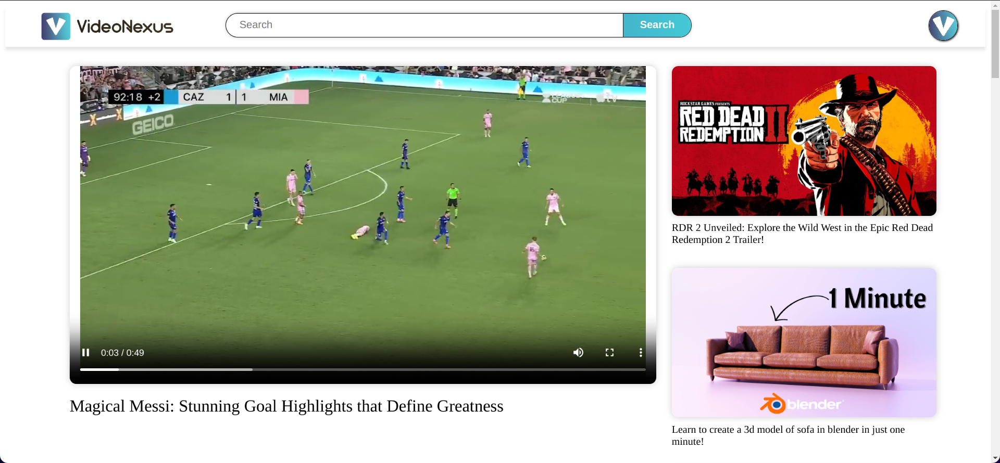
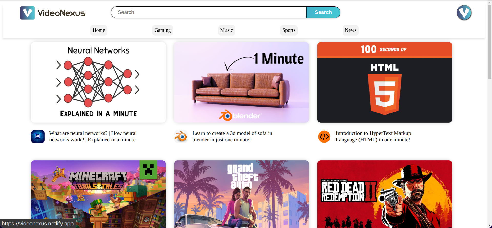

# Video Nexus

A dynamic web video entertainment platform built using HTML, CSS, and JavaScript. It allows users to explore a wide range of video categories, offering a seamless and enjoyable video playback experience.

## Table of Contents
- [Features](#features)
- [Screenshots](#screenshots)
- [Live Preview](#live-preview)
- [Documentation](#documentation)
- [Technologies Used](#technologies-used)
- [Contributing](#contributing)
- [License](#license)
## Features
- Browse videos across various categories
- Simple and intuitive video playback controls
- Clean and modern user interface

## Screenshots

## Live Preview
1. Click [here](https://videonexus.netlify.app/) to view live demo.

## Documentation
For a detailed overview of the project and its features, visit the [Documentation](./documentation) in the repository.

## Technologies Used
- HTML
- CSS
- JS

## Contributing
Contributions, issues, and feature requests are welcome!  
Feel free to check out the [issues page](https://github.com/miansaadtahir/videonexus/issues).

## License

This project is open source and available under the MIT [License](https://github.com/MianSaadTahir/Video-Nexus/blob/main/LICENSE).
